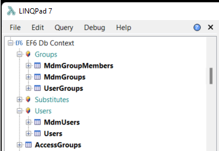

# Ef6.Core.LINQPadDriver
[](https://github.com/Peter-B-/Ef6.Core.LINQPadDriver/actions/workflows/build-and-publish.yml)


Entity Framework 6 driver for LINQPad 6 (.Net Core).

# Installation
Open LINQPad 6 and click "Add connection" in the connection overview. In the "Choose Data Context" dialog, select "View more drivers" and check "Show all drivers" in the top center.

Search for `Ef6.Core.LINQPadDriver` and install it.

# DB context creation

There should now be a "Entity Framework 6 on .Net Core" option in the "Choose Data Context" dialog. Select it and click "Next". 

Pick your EF6 assembly and select your DbContext type. Provide the full connection string and click "Ok".

Your DbContext must have a public constructor accepting a `nameOrConnectionString` string as a parameter:

```csharp
public class MyDbContext : DbContext
{
    public MyDbContext(string nameOrConnectionString) : base(nameOrConnectionString)
    {
    }
    
    // additional constructors are allowed
}
```

The driver has been tested with EntityFramework 6.4.4 and dotConnect for Oracle 9.14.1273.

# Grouping
The driver supports grouping DbSets by decorating them with a `System.ComponentModel.Category` attribute.

```csharp
public class MyDbContext : DbContext
{
    [Category("Groups")]
    public virtual DbSet<UserGroup> UserGroups { get; set; }

    [Category("Users")]
    public virtual DbSet<User> Users { get; set; }
}
```

You can also apply the `System.ComponentModel.Category` attribute to the entity:
 ```csharp
[Category("Users")]
public class User
{
    ...
}
```



